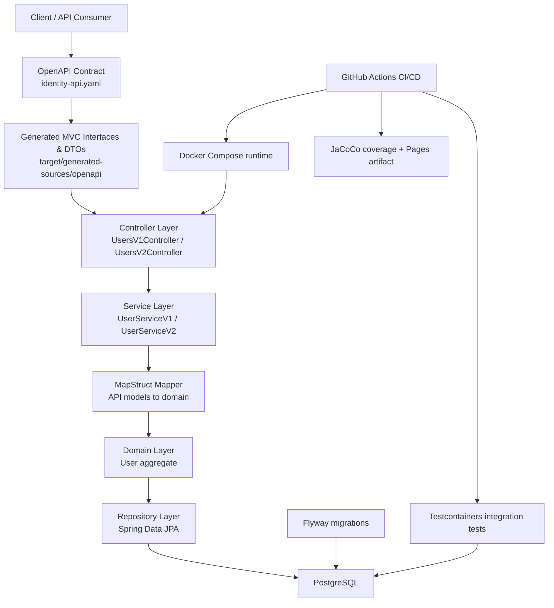

# Identity Service API

[](https://github.com/DanieleMasone/identity-service/actions/workflows/ci.yml)
[](LICENSE)
[](https://adoptium.net/temurin/releases/?version=21)
[](https://spring.io/projects/spring-boot)
[](https://danielemasone.github.io/identity-service/)

Production-style backend service for user identity management, built with Java 21, Spring Boot 4, PostgreSQL, Flyway, OpenAPI Generator, MapStruct, Testcontainers, Docker Compose and GitHub Actions.

The project is intentionally compact, but it demonstrates practices expected in a real backend team: contract-first APIs, generated Spring MVC interfaces, layered application boundaries, schema migrations, RFC 7807 errors, integration tests against PostgreSQL, Docker validation, JaCoCo coverage and automated GitHub Pages publication.

## Project Links

| Resource | Link |
| --- | --- |
| GitHub repository | [github.com/DanieleMasone/identity-service](https://github.com/DanieleMasone/identity-service) |
| CI/CD workflow | [GitHub Actions](https://github.com/DanieleMasone/identity-service/actions/workflows/ci.yml) |
| Public dashboard | [GitHub Pages](https://danielemasone.github.io/identity-service/) |
| OpenAPI docs | [Generated OpenAPI HTML documentation](https://danielemasone.github.io/identity-service/openapi/) |
| OpenAPI contract | [identity-api.yaml](https://github.com/DanieleMasone/identity-service/blob/master/src/main/resources/openapi/identity-api.yaml) |
| Postman collection | [identity-service.postman_collection.json](https://github.com/DanieleMasone/identity-service/blob/master/postman/identity-service.postman_collection.json) |
| Coverage report | [Published JaCoCo report](https://danielemasone.github.io/identity-service/coverage/) |
| Generated documentation site | [Maven site and JavaDoc](https://danielemasone.github.io/identity-service/maven-site/) |

## What It Demonstrates

* OpenAPI-first design with generated Spring MVC interfaces and DTOs
* Versioned `/api/v1` and `/api/v2` user APIs
* Layered structure: API, service, domain, persistence and infrastructure
* MapStruct mapping between generated API models and internal domain entities
* PostgreSQL persistence with Flyway migrations
* BCrypt password hashing and soft deletes
* RFC 7807 `ProblemDetail` error responses
* Unit, web-layer, repository and Testcontainers integration tests
* Maven JaCoCo XML and HTML coverage reports
* Docker Compose startup for PostgreSQL and the Spring Boot application
* GitHub Actions verification, Docker validation and Pages deployment

## Architecture Overview



## Generated Sources

OpenAPI and MapStruct code is generated during the Maven build and is not committed to the repository.

Run generation and compilation with:

```bash
mvn clean compile
```

Generated output:

```text
target/generated-sources/openapi
target/generated-sources/annotations
target/openapi-docs
```

Do not manually edit generated classes or generated OpenAPI HTML documentation. OpenAPI Generator owns the API interfaces/models and the static API docs, while MapStruct owns mapper implementations.

## OpenAPI Documentation

The OpenAPI YAML contract is the source of truth:

```text
src/main/resources/openapi/identity-api.yaml
```

Maven generates static OpenAPI HTML documentation from that contract with OpenAPI Generator. Local output is written to:

```text
target/openapi-docs/index.html
```

CI publishes the generated documentation at:

[https://danielemasone.github.io/identity-service/openapi/](https://danielemasone.github.io/identity-service/openapi/)

GitHub Pages is static and cannot expose the running Spring Boot Swagger UI. Swagger UI remains available only when the application is running locally:

```text
http://localhost:8080/api/swagger-ui.html
```

## Run Locally With Maven

Start PostgreSQL:

```bash
docker compose up -d db
```

Run the application:

```bash
mvn spring-boot:run
```

Default database credentials:

```text
DB_USERNAME=postgres
DB_PASSWORD=postgres
```

Local Swagger UI is available at:

```text
http://localhost:8080/api/swagger-ui.html
```

Use the published OpenAPI docs for public API documentation. Start the application locally only when you want the live Spring Boot Swagger UI.

## Run With Docker Compose

Start PostgreSQL and the Spring Boot application together:

```bash
docker compose up --build
```

Compose waits for PostgreSQL readiness before starting the application. Override credentials through `DB_USERNAME` and `DB_PASSWORD` when needed.

## API Overview

| Method | Path | Description |
| --- | --- | --- |
| `POST` | `/api/v1/users` | Create a v1 user |
| `GET` | `/api/v1/users/{id}` | Read a v1 user |
| `DELETE` | `/api/v1/users/{id}` | Soft-delete a user |
| `POST` | `/api/v2/users` | Create a v2 user with profile fields |
| `GET` | `/api/v2/users/{id}` | Read a v2 user |
| `PATCH` | `/api/v2/users/{id}` | Partially update profile/status |

## Testing And Coverage

Run the full verification suite:

```bash
mvn clean verify
```

This runs unit tests, web-layer tests, repository integration tests, service integration tests, packaging and JaCoCo report generation. Docker must be running because integration tests use Testcontainers with a real PostgreSQL container.

Coverage output:

```text
target/site/jacoco/index.html
target/site/jacoco/jacoco.xml
```

Generated OpenAPI classes and generated MapStruct implementations are excluded from coverage.

The HTML report is also published by CI at:

[https://danielemasone.github.io/identity-service/coverage/](https://danielemasone.github.io/identity-service/coverage/)

## GitHub Pages Dashboard

The public landing page is a lightweight static site in:

```text
docs/
```

No frontend framework is used. GitHub Actions publishes the dashboard as the Pages root and also publishes:

```text
/coverage/     JaCoCo HTML report
/openapi/      Maven-generated OpenAPI HTML documentation
/maven-site/   Maven site and JavaDoc
```

GitHub Pages should be configured with `Source: GitHub Actions`.

The dashboard is static. It links to the generated OpenAPI docs, OpenAPI contract, coverage report and Maven site, but it does not run the backend service.

## CI/CD Workflow

The GitHub Actions workflow runs on pushes and pull requests to `master`.

Verification job:

* checks out the repository
* installs Java 21 with Maven dependency caching
* runs `mvn clean verify`
* validates `docker compose config`
* builds the application Docker image with `docker compose build app`

On pushes to `master`, after verification succeeds, CI also:

* generates the Maven site with `mvn site`
* assembles the static Pages artifact
* configures GitHub Pages for Actions-based deployment
* publishes the dashboard, OpenAPI docs, Maven site and JaCoCo report to GitHub Pages

The workflow fails if tests, integration tests, OpenAPI documentation generation, coverage generation, Docker Compose validation or Docker image build fail.

## Docker Notes

`docker-compose.yml` defines:

* `db`: PostgreSQL 16 with a readiness healthcheck
* `app`: Spring Boot service built from the Dockerfile

The application receives:

```text
SPRING_DATASOURCE_URL=jdbc:postgresql://db:5432/identity_db
DB_USERNAME=postgres
DB_PASSWORD=postgres
```

## Design Notes

* v1 keeps the smallest stable user contract.
* v2 extends the API with profile fields and partial updates while preserving v1.
* Deletes are soft deletes through the `INACTIVE` status.
* API models are generated from OpenAPI; domain entities remain internal.
* MapStruct is configured to fail on unmapped target properties, making DTO drift visible during compilation.

## License

Released under the MIT License. See [LICENSE](LICENSE).

Copyright (c) 2026 Daniele Masone.
