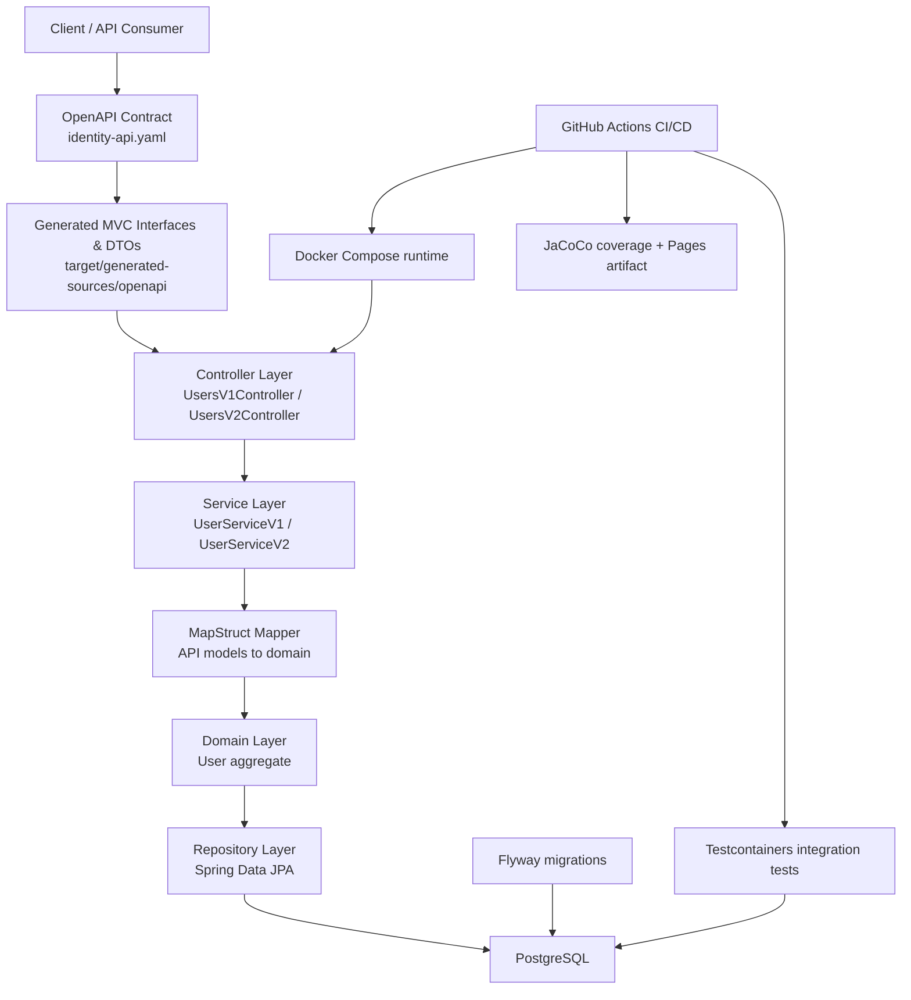

# Identity Service API

[](https://github.com/DanieleMasone/identity-service/actions/workflows/ci.yml)
[](https://danielemasone.github.io/identity-service/coverage/)
[](LICENSE)

Production-style backend service for user identity management, built with Java 21, Spring Boot 4, PostgreSQL, Flyway, OpenAPI Generator, MapStruct, Testcontainers, Docker Compose and GitHub Actions.

The project is intentionally compact, but it demonstrates practices expected in a real backend team: contract-first APIs, generated Spring MVC interfaces, layered application boundaries, schema migrations, RFC 7807 errors, integration tests against PostgreSQL, Docker validation, JaCoCo coverage and automated GitHub Pages publication.

## Project Links

| Resource | Link |
| --- | --- |
| GitHub repository | [github.com/DanieleMasone/identity-service](https://github.com/DanieleMasone/identity-service) |
| CI/CD workflow | [GitHub Actions](https://github.com/DanieleMasone/identity-service/actions/workflows/ci.yml) |
| Public dashboard | [GitHub Pages](https://danielemasone.github.io/identity-service/) |
| User guide | [Setup, runtime, testing, and delivery](https://danielemasone.github.io/identity-service/user-guide/) |
| OpenAPI docs | [Generated OpenAPI HTML documentation](https://danielemasone.github.io/identity-service/openapi/) |
| OpenAPI contract | [identity-api.yaml](https://github.com/DanieleMasone/identity-service/blob/master/src/main/resources/openapi/identity-api.yaml) |
| Postman collection | [identity-service.postman_collection.json](https://github.com/DanieleMasone/identity-service/blob/master/postman/identity-service.postman_collection.json) |
| Coverage report | [Published JaCoCo report](https://danielemasone.github.io/identity-service/coverage/) |
| Generated documentation site | [Maven site and JavaDoc](https://danielemasone.github.io/identity-service/maven-site/) |

## What It Demonstrates

* OpenAPI-first design with generated Spring MVC interfaces and DTOs
* Versioned `/api/v1` and `/api/v2` user APIs
* Layered structure: API, service, domain, persistence and infrastructure
* MapStruct mapping between generated API models and internal domain entities
* PostgreSQL persistence with Flyway migrations
* BCrypt password hashing and soft deletes
* RFC 7807 `ProblemDetail` error responses
* Unit, web-layer, repository and Testcontainers integration tests
* Maven JaCoCo XML and HTML coverage reports
* Docker Compose startup for PostgreSQL and the Spring Boot application
* GitHub Actions verification, Docker validation and Pages deployment

## Architecture Overview


```mermaid
flowchart TD
    consumer["Client / API Consumer"] --> contract["OpenAPI Contract<br/>identity-api.yaml"]
    contract --> generated["Generated MVC Interfaces & DTOs<br/>target/generated-sources/openapi"]
    generated --> controller["Controller Layer<br/>UsersV1Controller / UsersV2Controller"]
    controller --> service["Service Layer<br/>UserServiceV1 / UserServiceV2"]
    service --> mapper["MapStruct Mapper<br/>API models to domain"]
    mapper --> domain["Domain Layer<br/>User aggregate"]
    domain --> repository["Repository Layer<br/>Spring Data JPA"]
    repository --> postgres["PostgreSQL"]

    flyway["Flyway migrations"] --> postgres
    tests["Testcontainers integration tests"] --> postgres
    docker["Docker Compose runtime"] --> controller
    actions["GitHub Actions CI/CD"] --> tests
    actions --> docker
    actions --> coverage["JaCoCo coverage + Pages artifact"]
```

## Quick Start

Start PostgreSQL and the application:

```bash
docker compose up --build
```

For a Maven development run, start only PostgreSQL and then the application:

```bash
docker compose up -d db
mvn spring-boot:run
```

The API base URL is `http://localhost:8080/api`.

## User Guide

For local setup, Docker usage, testing, coverage, OpenAPI documentation and CI/CD details, see:

[User Guide](https://danielemasone.github.io/identity-service/user-guide/)

## API Overview

| Method | Path | Description |
| --- | --- | --- |
| `POST` | `/api/v1/users` | Create a v1 user |
| `GET` | `/api/v1/users/{id}` | Read a v1 user |
| `DELETE` | `/api/v1/users/{id}` | Soft-delete a user |
| `POST` | `/api/v2/users` | Create a v2 user with profile fields |
| `GET` | `/api/v2/users/{id}` | Read a v2 user |
| `PATCH` | `/api/v2/users/{id}` | Partially update profile/status |

## Design Notes

* v1 keeps the smallest stable user contract.
* v2 extends the API with profile fields and partial updates while preserving v1.
* Deletes are soft deletes through the `INACTIVE` status.
* API models are generated from OpenAPI; domain entities remain internal.
* MapStruct is configured to fail on unmapped target properties, making DTO drift visible during compilation.
* PostgreSQL owns email uniqueness; service logic translates both pre-checks and constraint races into the documented `409` response.

## Project Status

Feature-complete within the documented v1/v2 identity-management scope. The standard acceptance gate is `mvn clean verify`, with Docker image and Compose validation in CI.

## License

Released under the MIT License. See [LICENSE](LICENSE).

Copyright (c) 2026 Daniele Masone.
